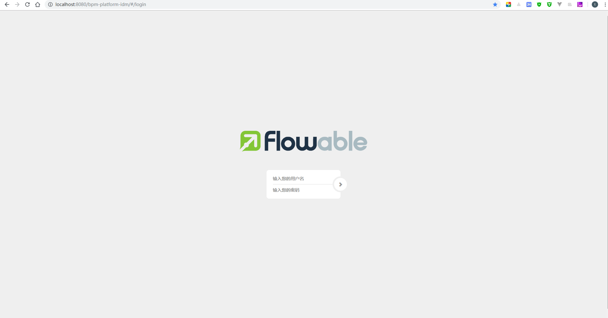
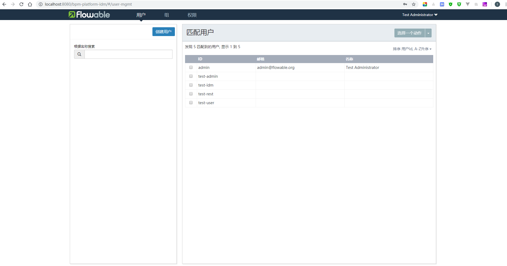
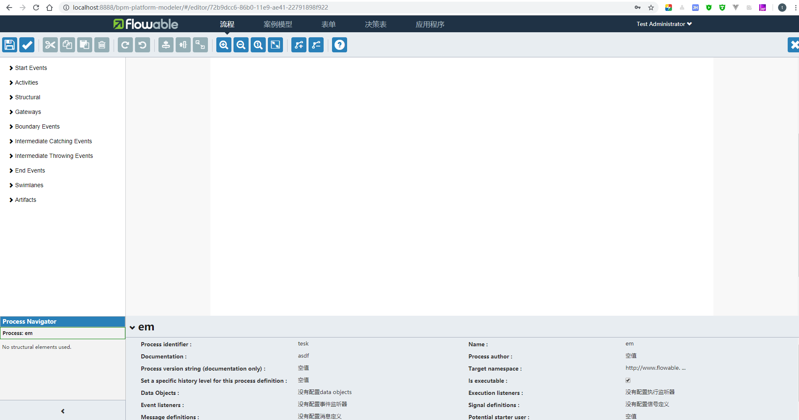
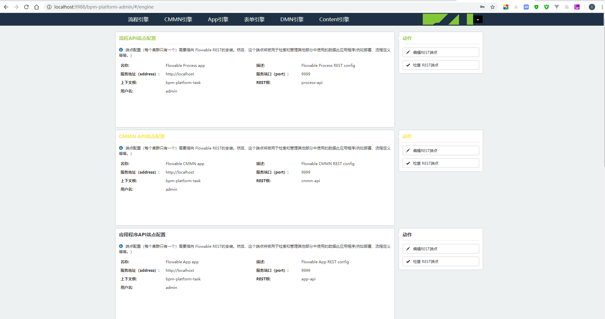
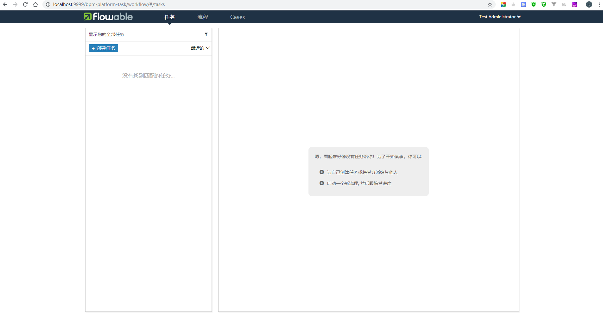
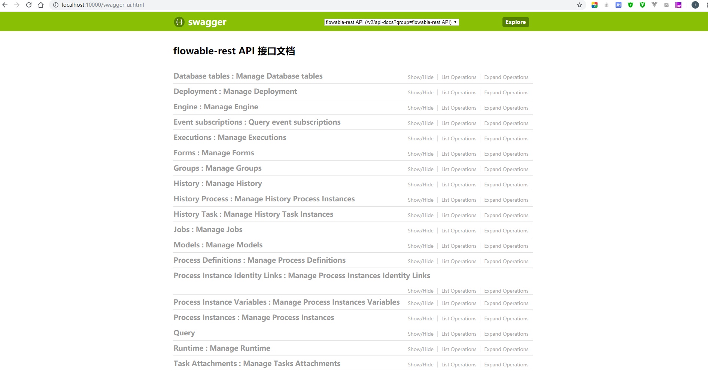

# bpm-platform

bpm platform based flowable 6.4.1

由于 `flowable` 是开源框架考虑情况比较多，而我们定制化开发的时候，考虑的情况相对较少
在此参考 框架源码工程 `flowable-engine` 进行定制化开发。

## 工程结构

- bpm-platform
   - [x] bpm-platform-idm     -- 用户认证与授权
   - [x] bpm-platform-modeler -- 在线设计器
   - [x] bpm-platform-task    -- 任务管理
   - [x] bpm-platform-admin   -- 流程管理
   - [x] bpm-platform-rest    -- 流程API提供

#####  技术实现    

| 服务    | 项目    |  端口 |
|:----------|:--------------------------|  :----  |
| 用户认证与授权 | bpm-platform-idm       | 8080  |
| 在线设计器    | bpm-platform-modeler   | 8888  |
| 流程管理      | bpm-platform-admin     | 9988  |
| 任务管理      | bpm-platform-task      | 9999  |
| 流程API提供      | bpm-platform-rest     | 10000  |

##### 配置 `hosts`

127.0.0.1       mysql.ithinksky.com

## 工程预览

### [用户认证与授权](http://localhost:8080/bpm-platform-idm/#/login)
  
  

### [在线设计器](http://localhost:8888/bpm-platform-modeler/#/processes)
  

### [流程管理](http://localhost:9988/bpm-platform-admin/#/engine)
  

### [任务管理](http://localhost:9999/bpm-platform-task/#/)
  

### [Rest接口](http://localhost:10000/bpm-platform-rest/swagger-ui.html)
  

## reference & recommend
- [flowable-engine](https://github.com/flowable/flowable-engine)
